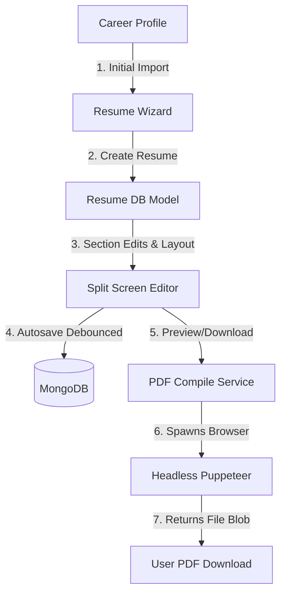

# Resume Builder Module Documentation

This document describes the architectural layout, data flows, database models, rendering templates, PDF compilers, and extension points for the CareerHub AI Resume Builder.

---

## 1. Resume Builder Architecture

The Resume Builder is designed to enable users to create tailored, ATS-friendly resumes compiled directly from their core **Career Profile**.

---

## 2. Database Relationships

The module operates using two primary collections:
1. `resumes`: Stores the main resume document, customization choices, and copy of profile section details.
2. `resumeversions`: Stores history checkpoints/snapshots for reverting updates.

### Schema Relationships
* **User (`users`)** -> Has many -> **Resume (`resumes`)**
* **Profile (`profiles`)** -> References -> **Resume (`resumes`)** (via `resumeReference` field representing the default resume).
* **Resume (`resumes`)** -> References -> **ResumeTemplate (`resumetemplates`)** (via `templateId`).
* **ResumeVersion (`resumeversions`)** -> References -> **Resume (`resumes`)** (via `resumeId` for history tracking).

---

## 3. Resume Data Flow

1. **Wizard initialization**: When the user launches the Resume Builder wizard, the system fetches their consolidated career profile details.
2. **Profile Mapping**: The backend maps raw career details (e.g. `experience` collection, `education` collection) into structured `sections` using a schema-matching mapper.
3. **Draft copy detachment**: Once the resume is created, it maintains its own independent copy of sections. Editing the resume does not alter the user's primary Career Profile. This allows users to create different targeted versions of their resume (e.g. "React Developer Resume" vs "Fullstack Engineer Resume").
4. **Auto-save debouncing**: Changes in the split-screen editor are monitored and debounced for 1500ms on the client before triggering updates on the backend.
5. **Autosave Snapshots**: The backend automatically captures snapshot checkpoints in the `resumeversions` collection when major updates are made, allowing users to restore previous versions easily.

---

## 4. REST API Documentation

All endpoints register under `/api/v1/resumes`.

| Method | Endpoint | Description | Auth Required |
| :--- | :--- | :--- | :--- |
| **GET** | `/api/v1/resumes` | Retrieve all active resumes of the user | Yes |
| **POST** | `/api/v1/resumes` | Create a new resume (optionally imports profile) | Yes |
| **GET** | `/api/v1/resumes/:id` | Fetch specific resume content | Yes |
| **PATCH** | `/api/v1/resumes/:id` | Update resume fields (Autosave/Customization) | Yes |
| **DELETE** | `/api/v1/resumes/:id` | Archive/Delete a resume version | Yes |
| **POST** | `/api/v1/resumes/:id/default` | Mark resume as primary profile reference | Yes |
| **POST** | `/api/v1/resumes/:id/duplicate` | Duplicate resume sections & customization | Yes |
| **POST** | `/api/v1/resumes/:id/publish` | Set sharing options and generate public slug | Yes |
| **POST** | `/api/v1/resumes/:id/unpublish` | Turn off sharing options (set to private) | Yes |
| **GET** | `/api/v1/resumes/:id/versions` | List all historical version snapshots | Yes |
| **POST** | `/api/v1/resumes/:id/versions/:vId/restore`| Restore resume content to snapshot | Yes |
| **POST** | `/api/v1/resumes/:id/export/pdf` | Stream compiled PDF file download | Yes |
| **GET** | `/api/v1/resumes/public/:user/:slug`| Fetch public copy anonymously | No |

---

## 5. Template Architecture

Resumes can be dynamically rendered using 5 templates:
1. **Classic ATS** (`classic-ats`): Strict single-column, no graphics or tables, optimized for maximum parsing compliance.
2. **Modern Professional** (`modern-professional`): Sans-serif font hierarchy with colored left-accent highlight.
3. **Minimal** (`minimal`): Centered titles, dashed dividers, and high margins.
4. **Software Developer** (`software-developer`): Monospace typeface, skill tag blocks, and code repository links listed prominently.
5. **Fresh Graduate** (`fresh-graduate`): Prioritizes education coursework, certificates, and projects above experience.

---

## 6. PDF Generation Architecture

PDF generation utilizes **Puppeteer** on the server to execute high-fidelity rendering.
1. The backend resolves the template design and maps sections to HTML with inline CSS styles matching the user's layout customization (accent color, font sizes, margins).
2. Spawns a headless Puppeteer browser instance.
3. Sets page content to compiled HTML and waits for loading to settle.
4. Compiles text using browser layout engines to guarantee selectable-text support and print margin alignments.
5. Generates the PDF buffer stream and pipes it directly as a file download.

---

## 7. Future AI Integration Points

Service entrypoints and mock stubs are defined in `AiService` for future integrations:
* **AI Summary Improver**: Hooked via `POST /api/v1/resumes/ai/improve` to let Gemini refine profile summaries.
* **AI Achievements bullet builder**: Hooked via `POST /api/v1/resumes/ai/bullet` using Action-Task-Tech-Result-Impact format to phrase impactful achievements.
* **AI Keyword Suggestion**: Hooked via `POST /api/v1/resumes/ai/suggest-keywords` to scan resume sections against a job description, identify missing keywords, and suggest improvements.
